# Ghidra Version
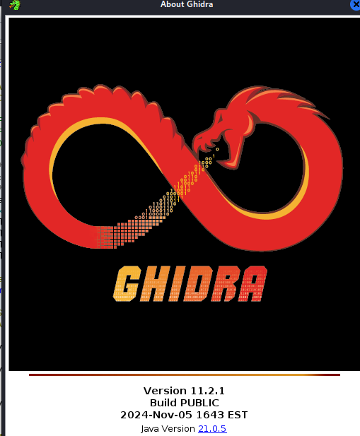
Version 11.2.1, released on 4th Nov. 2024. JAVA V.21.0.5.

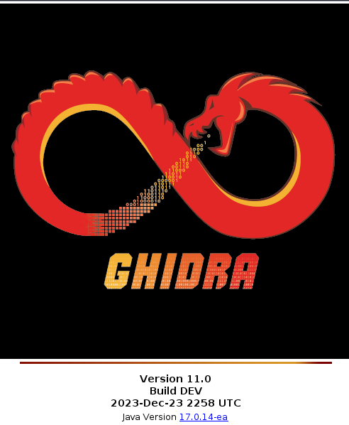
Ghidra V 11.0, released on 23rd Dec. 2023. JAVA V.17.0.14-ea.

# Binary sizes
### C - Windows Compilation
Unstripped.
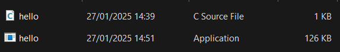
---
Stripped.
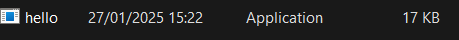

### C - Kali Compilation
Unstripped
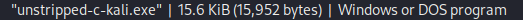

Stripped
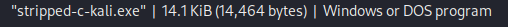

---
---
---
### Rust - Windows
#### Release
This is the default stripping method.
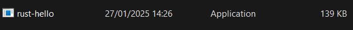

#### Debug
Unstripped.
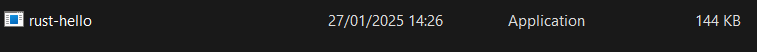

### Rust - Kali
#### Release
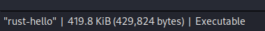

#### Debug
This is much lager.

---

Stripped.
### Release
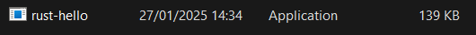

### Debug
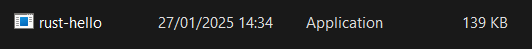

### toml
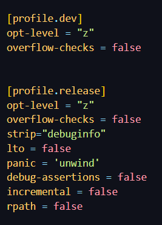

---
---
---

# Reverse Engineering

### Windows Compilation (Stripped)
If I directly import the rust biary (compiled in Windows), it
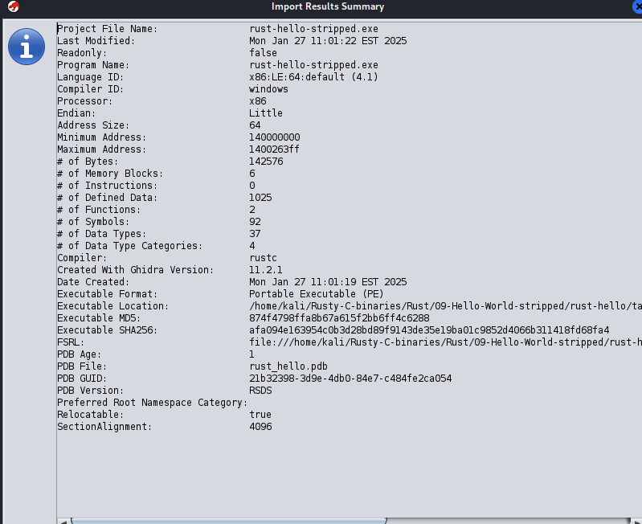
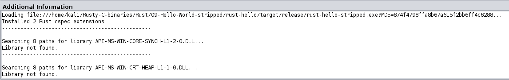
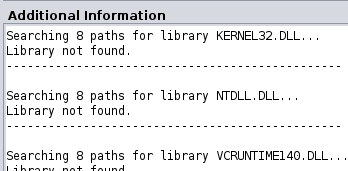
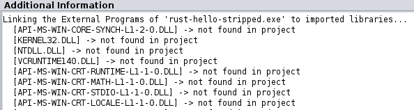
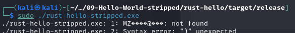

They couldn't find the Windows OS libraries/

### Kali Compilation (Stripped)
# Rust (Stripped)
#### This is the import rummary result of Ghidra.
We can see mangledstrings at the beginning.
### Debug

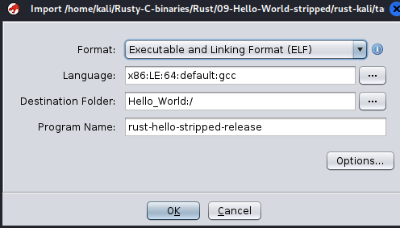

### Release
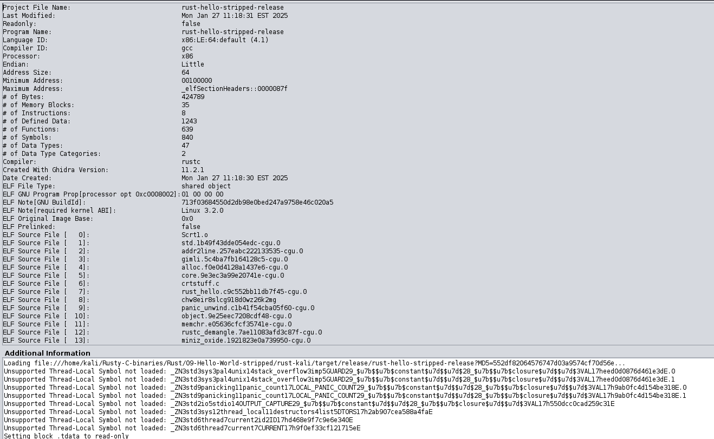
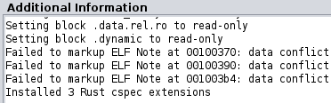
They tried to link Linux OS libraries.
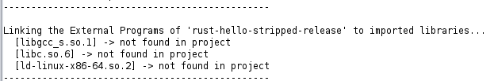
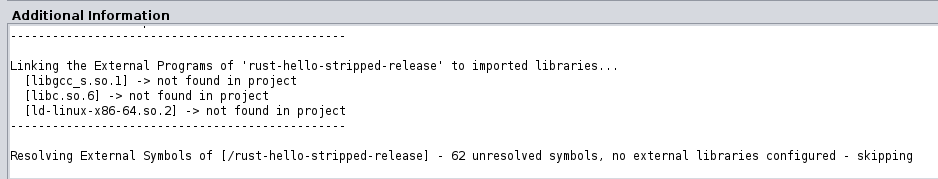

# C (Stripped)

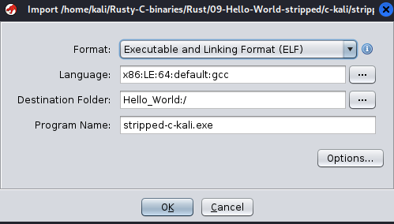
The binary is apparently much smaller containing less information.
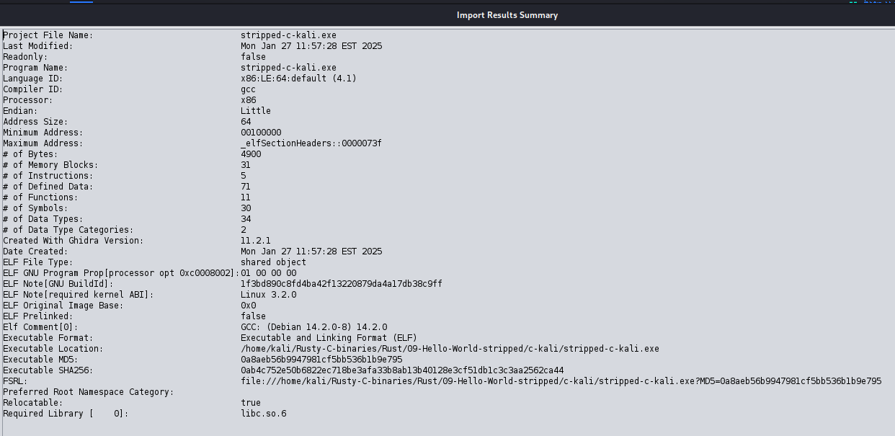
Dynamic Linking failed.
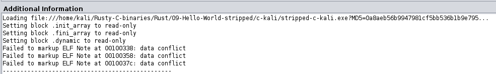
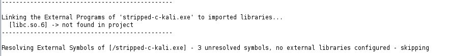

### Analysing Options are different from Rust version.
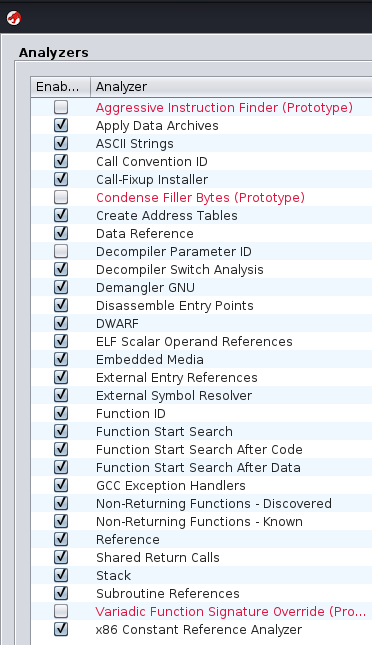

# RE
### Rntry Point
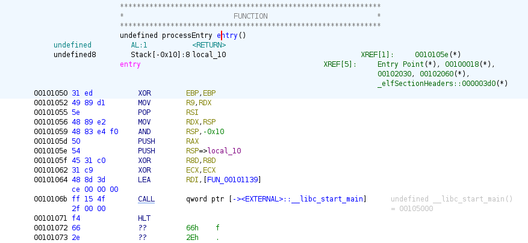
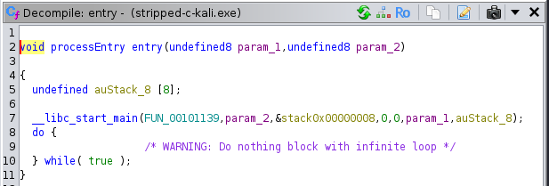

No direct link to `main`function due to stripping.
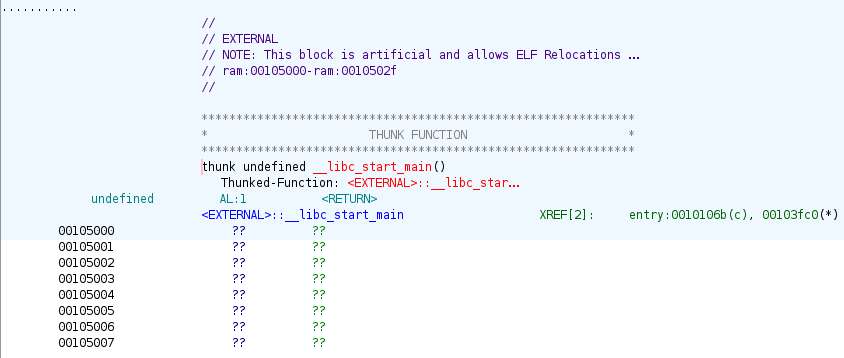
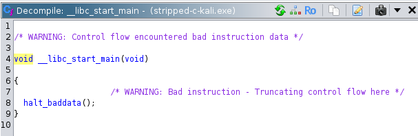
From `Symbol Tree`, we cannot find `_start` (original entry point before `libc_start_main`) or `main`.
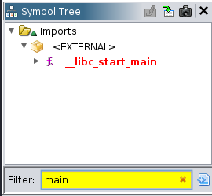
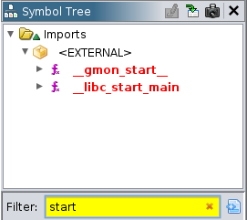

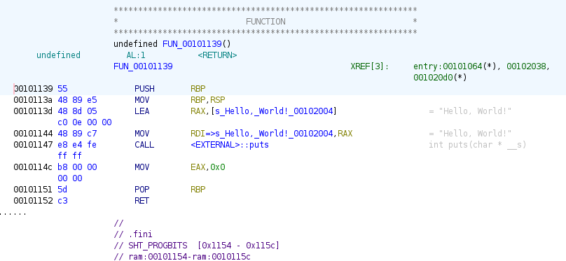
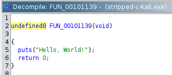

## Code flow
Check the diagrams

----
----
---

# Unstripped
## Rust (Unstripped)
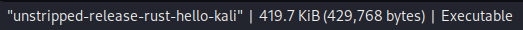

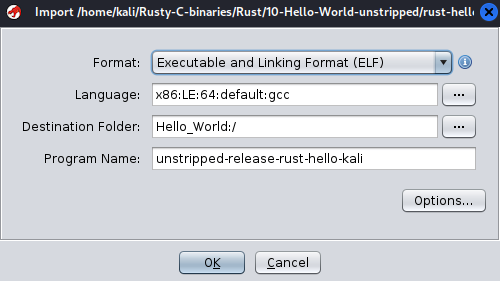
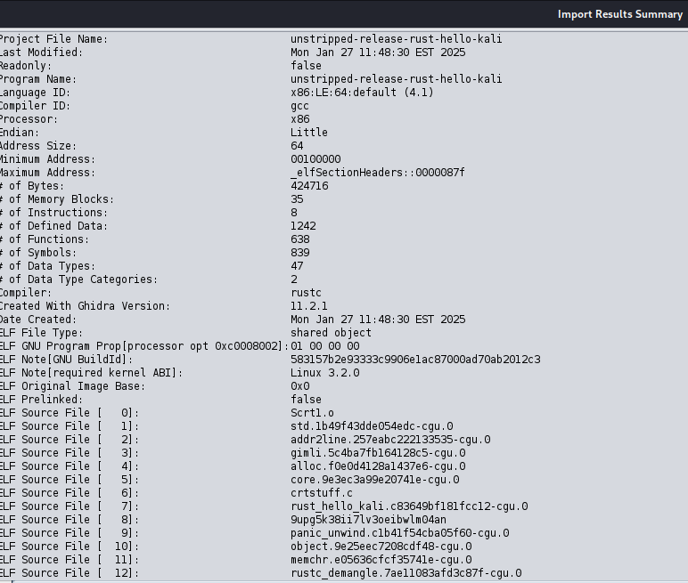
More `ELF` source files while importing the binary to Ghidra.
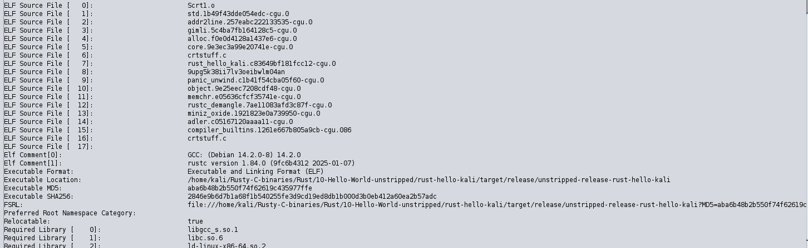
More required libraries.
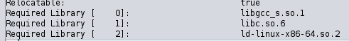
Many unsupported thread symbols due to the mangling scheme/strings.
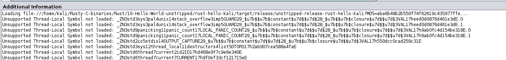
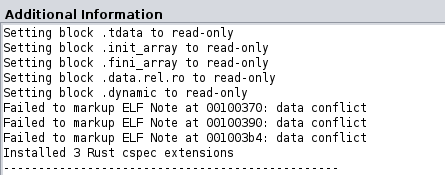
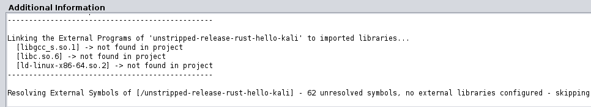

---

# RE
## Ghidra V.2024
- ⭐ So, actually Ghidra can detect whether the binary is Rust or not.
- But fail to demangle the rust managled strings

## Ghidra V.2023

### Before
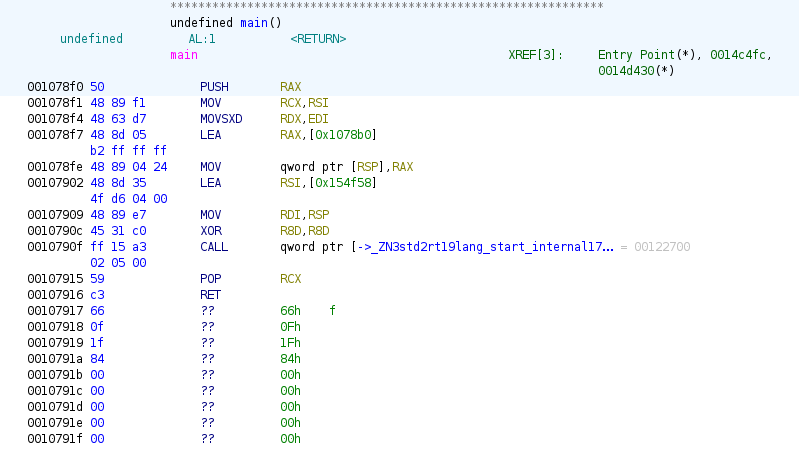

### After
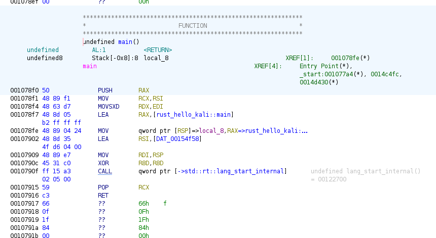
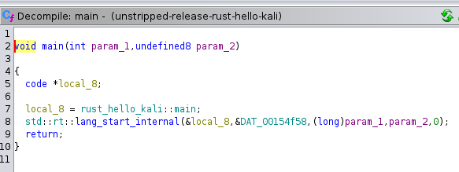

## Analyzers
They all have functions below:
- Demangler Rust
- Rust String Analyzer
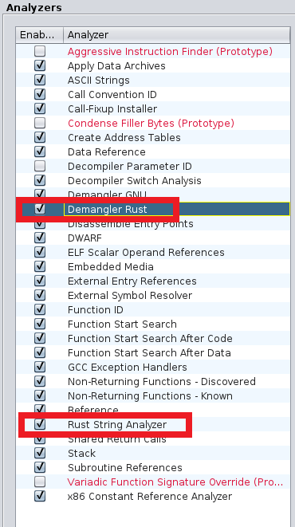

Entry point can find `main` in Rust if this binary is unstripped.

However, the strings are manageld still.
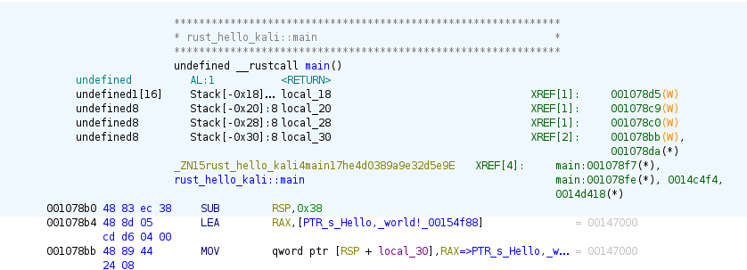

Need to manually demange the strings if possible.
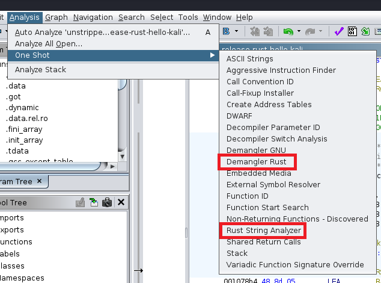

Tried Legact feature, it seems not working.
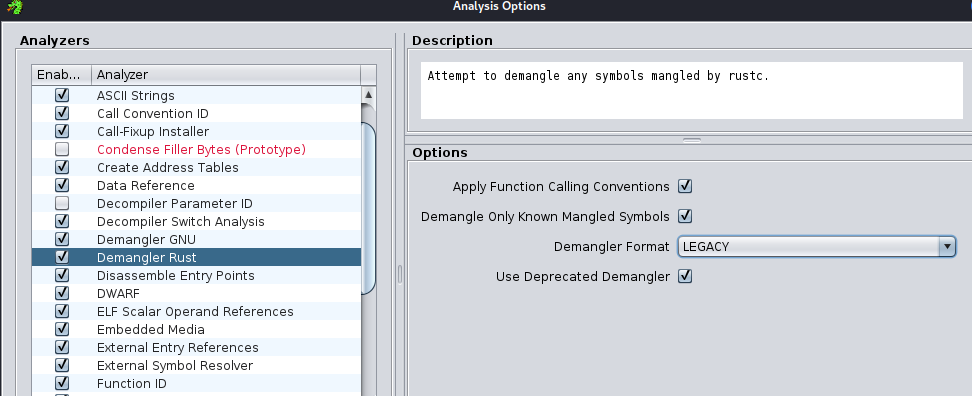

# Code flow
You can find the diagram above as well.
## Symbol Tree  

## RT module

## _start

# _libc_start_main

# main

# Rust Runtime (RT)
## lang_start
## lang_start_internal

# Panicking

# Thread

Please view the diagram above for clear overview.

---

## C (Unstripped)

### Dynamic Linking
- That's because I compiled the c program with `gcc` on Kali Linux without static linking.
- The binary doesn't contain the full implementation of the library functions it used (like `printf`).
- Instead, it relies on shared libraries (e.g., `libc.so.6`) that are linked at runtime by the dynamic linker (`ld-linux.so`).

### Analysing Options are different from Rust version.

Main function shows up immediately.

Symbol Tree shows the clear pattern as well.

## Code flow
Check with the diagrams

