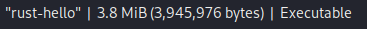

# Binary sizes
### C - Windows Compilation
Unstripped.

---
Stripped.

### C - Kali Compilation
Unstripped

Stripped

---
---
---
### Rust - Windows
#### Release
This is the default stripping method.

#### Debug
Unstripped.

### Rust - Kali
#### Release

#### Debug
This is much lager.

---

Stripped.
### Release

### Debug

### toml

---
---
---

# Reverse Engineering

### Windows Compilation (Stripped)
If I directly import the rust biary (compiled in Windows), it

They couldn't find the Windows OS libraries/

### Kali Compilation (Stripped)
# Rust (Stripped)
#### This is the import rummary result of Ghidra.
We can see mangledstrings at the beginning.
### Debug

### Release

They tried to link Linux OS libraries.

# C (Stripped)

----
----
---

# Unstripped
## Rust (Unstripped)

More `ELF` source files while importing the binary to Ghidra.

More required libraries.

Many unsupported thread symbols due to the mangling scheme/strings.

## C (Unstripped)

### Dynamic Linking
- That's because I compiled the c program with `gcc` on Kali Linux without static linking.
- The binary doesn't contain the full implementation of the library functions it used (like `printf`).
- Instead, it relies on shared libraries (e.g., `libc.so.6`) that are linked at runtime by the dynamic linker (`ld-linux.so`).

